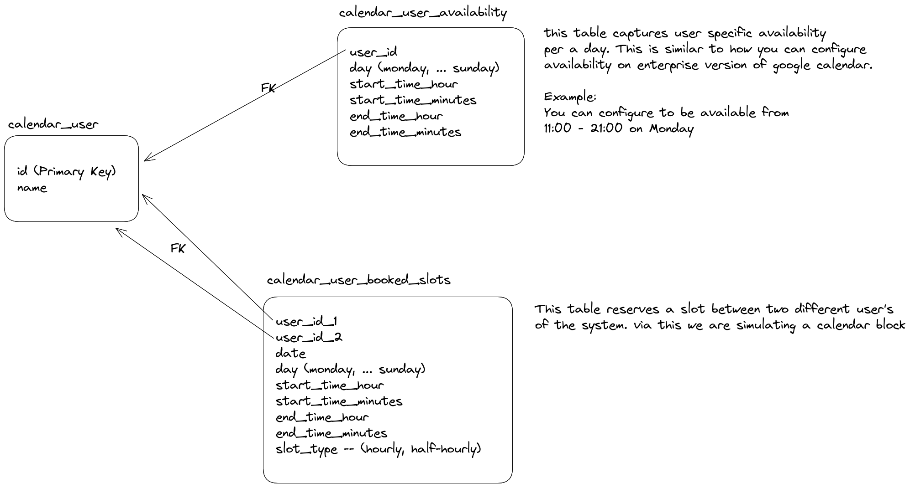

# Harbor Take Home Project

Note: this is a fork of [this](https://github.com/harbor-xyz/coding-project) repo that contains the original problem statement

## Stack

### Database

SQLite is chosen to help deploy the application easily. 

### Go

API server is written in Go

## API

Postman collection is exported [here](./go-harbor.postman_collection.json)

## Database design

Design is as follows



## Live API

API is deployed to fly (heroku alternative) and the url is [here](https://server-morning-hill-2045.fly.dev/v1/). 
Please checkout postman doc for more info about each API's.

In summary we have
`/v1/create-user` 

Body: ```json
{"name": "<name of the user"}
```

/v1/user/set-availability -- {"user_id": "<user_id>", "day": <monday, tuesday, wednesday, thursday, friday, saturday, sunday>, "start_time_hour": 14, "start_time_minutes": 0, "end_time_hour": 21, "end_time_minutes": 0}

/v1/user/find-available-slots -- {"user_id_1": <your user_id>, "user_id_2": <your_peer_user_id>, "date": "2024-07-15", "slot": "14:30", "slot_lookup_config": {"slot_duration": <hourly, half-hourly>, "search_every": <15, 30, 60>}}

/v1/user/book-slot -- {"user_id_1": <your_user_id>, "user_id_2": <your_peer_user_id>, "date": "2024-07-15", "slot": "14:30", "slot_lookup_config": {"slot_duration": "half-hourly", "search_every": 30}}

/v1/user/view-schedule -d '{"user_id": <your_user_id>, "date": "2024-07-15"}'

Kindly replace the fillers in <> with appropriate data for correct testing
